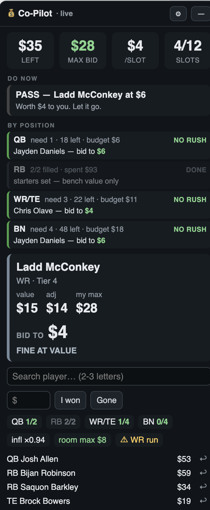
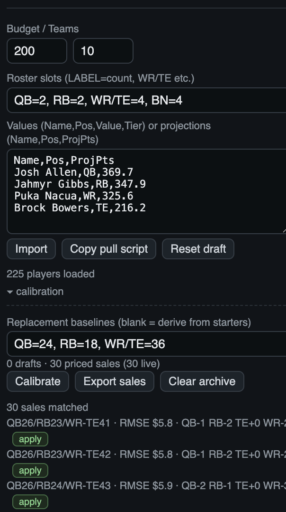
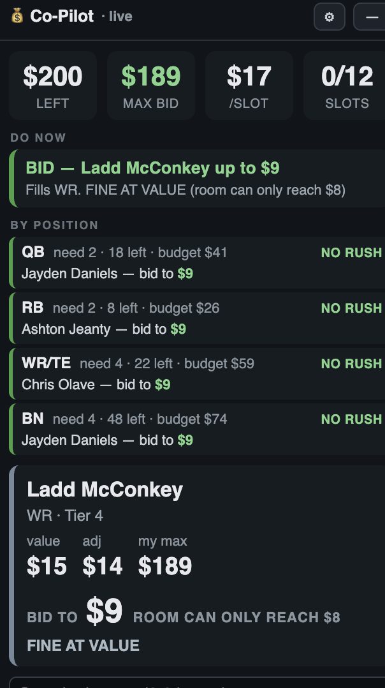

# Auction Draft Co-Pilot

Read-only Chrome extension that overlays a live assistant on an ESPN salary cap
(auction) draft room. It prices players for *your* league's roster rules, tracks every
sale to keep inflation honest, and tells you the most you should pay for the player on
the block.

> Not affiliated with, endorsed by, or sponsored by ESPN or The Walt Disney Company.
> ESPN is their trademark, used here only to say what the extension reads. This is a
> personal, non-commercial project.



## Load it

1. Chrome → `chrome://extensions` → enable **Developer mode** (top right)
2. **Load unpacked** → pick this folder
3. Open your draft room (real or mock). The panel appears top-right.

After editing code: `chrome://extensions` → ↻ on the extension card → refresh the draft tab.

## Set it up for your league

Open **⚙ settings** in the panel:

- **Budget / Teams** — auction budget per team, and how many teams.
- **Roster slots** — `LABEL=count`, comma separated. `QB=2, RB=2, WR/TE=4, BN=4` means
  two QBs, two RBs, four spots either WR or TE, and four bench. A slash means the
  positions share a slot and therefore share a price: with `WR/TE`, a tight end is worth
  exactly what a receiver scoring the same is worth. `BN` (or `BENCH`) is depth — it
  costs money but creates no starter demand.
- **Values box** — paste your player numbers and hit **Import**.



Roster shape drives everything. Replacement level is computed from the slots you enter,
so a 2QB league and a 1QB league produce genuinely different prices from the same
projections. That is the whole point.

## Getting player numbers in

The box takes either format and tells you which it used:

| Format | Columns | What happens |
|---|---|---|
| Finished values | `Name,Pos,Value,Tier` | Used as-is. Tier optional. |
| Projections | `Name,Pos,ProjPts` | Priced by the built-in model, using your slots. |

Tabs or commas, header optional. It distinguishes them by content — a `ProjPts` header,
decimals in column 3, or a figure larger than your budget all mean projections — and the
import message always says which it picked and what it did.

**Where projections come from is up to you.** None ship with this repo. Any source works
as long as it lands in `Name,Pos,ProjPts` form. If you want ESPN's own numbers scored
under your league's rules, ⚙ → **Copy pull script** hands you a console snippet
pre-filled with your league id; paste it into DevTools on a fantasy.espn.com page and
copy out the CSV. That request runs in your browser, in your session, by hand — the
extension itself never makes one.

## Calibrate it to your league

The one number that cannot be read off your league's rules is **replacement baseline** —
how many players at each position are worth real money. It has to be fitted against what
a room actually pays. Mock drafts are how you get that data, and the panel collects it
for you:

1. Run a mock draft with the panel open. It records every sale and price.
2. Enter another draft room. The finished draft is archived automatically — this is why
   your mocks are not lost when you start a new one.
3. ⚙ → **calibration** → **Calibrate**. It sweeps candidate baselines against your
   archived sales and ranks them by error, showing per-position bias so you can see
   *where* the model is wrong and not just how much.
4. **apply** the winner, then re-import your projections to reprice.

Two or three mocks is enough to be useful. Under 30 matched sales it says so and tells
you to treat the result as a hint.

For the full table, or to script it:

```
node tools/calibrate.js projections.csv sales.csv --teams 10 --slots 'QB=2, RB=2, WR/TE=4, BN=4'
```

`sales.csv` is what ⚙ → **Export sales** gives you. Scoring is raw RMSE against observed
prices. It deliberately does not correct for auction timing — early nominations clear
far above list and late ones crater — so absolute error is only comparable within one
dataset. The ranking is the useful part.

## Use it during the draft

- Nomination detection pins the player automatically; the **search box** (2–3 letters) is
  the fallback.
- **BID TO is a ceiling, not a target** — the most you should pay, already adjusted for
  inflation and for what you can still afford.
- **I won** + price logs to your roster; **Gone** marks anyone else's win (price optional,
  feeds inflation). **↩** on a roster row undoes.
- Panel flashes **amber** within $3 of your max, **red** past it.
- Everything persists across refresh. **Reset draft** clears sales and roster but keeps
  your values, settings, and calibration archive.

Late in a draft, once your opponents are broke, BID TO stops being about the player's value
and starts being about what the room can physically reach — no player can cost more than the
richest opponent's remaining budget plus $1:



`DRAFT-NOTES.md` has the strategy findings from building this — why quarterbacks are
mispriced in 2QB leagues, why early prices run ~1.7× value, and the endgame read that
matters most.

## Guarantees

- Permissions: `storage` only. **No network requests**, no simulated clicks, no automated
  bidding — it reads the DOM of a page you are already looking at and draws a panel.
- No blocking dialogs anywhere. A native `confirm()` freezes every event on the page,
  which mid-auction is the last thing you want.
- The panel stays fully usable if detection fails entirely (search + buttons).
- No projection data, values, or draft results are committed to this repo.

## Batch tools

Optional — the panel does all of this itself.

```
node tools/build-values.js projections.csv > values.csv   # price a projection set
node tools/calibrate.js projections.csv sales.csv         # fit baselines
```

Both take `--teams`, `--budget`, and `--slots` with the same spec the panel uses.
`tools/value-model.js` is the model itself and runs unchanged in Node and the browser,
so the panel's numbers are provably the ones these tools produce.

`reference/test-values.csv` is a 5-player CSV for mock-draft smoke tests.
